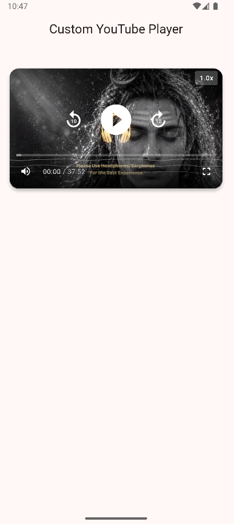
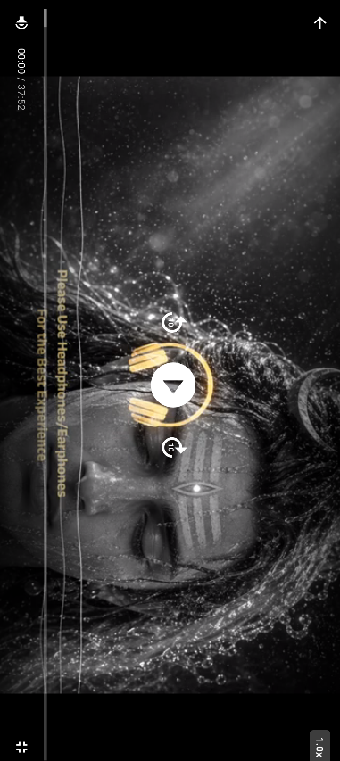

# Flutter YouTube Player

A custom YouTube video player built with Flutter that provides full control over video playback without using the official YouTube Player SDK.

This project uses:

- `youtube_explode_dart` for extracting YouTube video streams
- `video_player` for handling playback

---

## Features

- Custom video controls
- Play / Pause support
- Seek forward & backward
- Volume control
- Playback speed adjustment
- Fullscreen landscape mode
- Auto-hiding controls
- Buffering indicator
- Graceful error handling
- Responsive UI
- Material Design 3 support

---

## Dependencies

```yaml
dependencies:
  flutter:
    sdk: flutter
  video_player: ^2.9.1
  youtube_explode_dart: ^2.3.2
  cupertino_icons: ^1.0.8
```

---

## Installation

### 1. Clone the Repository

```bash
git clone <repository-url>
cd flutter_youtube_player
```

### 2. Install Dependencies

```bash
flutter pub get
```

### 3. Run the App

```bash
flutter run
```

---

## Project Structure

```bash
lib/
├── main.dart
├── youtube_player_widget.dart
└── youtube_player_controller_helper.dart

assets/
└── screenshots/
    ├── home.png
    └── fullscreen.png
```

### File Overview

| File | Description |
|------|-------------|
| `main.dart` | App entry point and demo screen |
| `youtube_player_widget.dart` | Custom YouTube player widget |
| `youtube_player_controller_helper.dart` | Extracts YouTube video IDs |

---

## Usage

### Basic Usage

```dart
import 'youtube_player_widget.dart';

YoutubePlayerWidget(
  url: 'https://www.youtube.com/watch?v=VIDEO_ID',
)
```

---

## Example Implementation

```dart
class YoutubeDemoScreen extends StatelessWidget {
  static const String videoUrl =
      'https://www.youtube.com/watch?v=hlWiI4xVXKY';

  const YoutubeDemoScreen({super.key});

  @override
  Widget build(BuildContext context) {
    return Scaffold(
      appBar: AppBar(
        title: const Text('Custom YouTube Player'),
      ),
      body: YoutubePlayerWidget(
        url: videoUrl,
      ),
    );
  }
}
```

---

## How It Works

### 1. Video ID Extraction

The `YoutubePlayerControllerHelper` extracts the 11-character YouTube video ID from different YouTube URL formats using regex.

### 2. Stream Extraction

Using `youtube_explode_dart`, the app:

- Fetches the video manifest
- Selects the highest bitrate muxed stream
- Retrieves the direct video stream URL

### 3. Video Playback

The `video_player` package manages:

- Network video streaming
- Playback controls
- Seeking
- Volume control
- Playback speed
- Buffering states

### 4. Custom Controls

| Control | Function |
|---------|----------|
| Play/Pause | Toggle playback |
| -10s | Seek backward |
| +10s | Seek forward |
| Progress Bar | Seek to position |
| Volume Toggle | Mute / unmute |
| Speed Menu | Change playback speed |
| Fullscreen | Enter fullscreen mode |

---

## Fullscreen Mode

When fullscreen mode is enabled:

- Device orientation switches to landscape
- System UI becomes immersive
- Playback state is preserved
- Back button exits fullscreen safely

---

## Controls Overview

| Action | Behavior |
|--------|----------|
| Tap on video | Show / hide controls |
| Play/Pause button | Toggle playback |
| -10s button | Rewind 10 seconds |
| +10s button | Forward 10 seconds |
| Progress bar | Seek video |
| Volume button | Mute / unmute |
| Speed button | Change speed |
| Fullscreen button | Open fullscreen |
| Back button | Exit fullscreen |

---

## Error Handling

The app handles:

- Invalid YouTube URLs
- Internet/network issues
- Stream extraction failures
- Playback errors
- Request limit exceptions

Friendly error messages are displayed inside the player UI.

---

## Platform Support

| Platform | Support |
|----------|---------|
| Android | Full Support |
| iOS | Supported |
| Web | Limited Support |

---

## Important Notes

- This project bypasses YouTube’s official player SDK
- It may not comply with YouTube Terms of Service
- For production apps, consider using:
  - `youtube_player_flutter`
- Video quality is automatically selected as the best available stream
- Some videos may be region or copyright restricted
- Excessive requests may trigger YouTube rate limiting

---

## Screenshots

| Home Screen | Fullscreen |
|-------------|------------|
|  |  |

---

## License

This project is for educational purposes only.

---

## Flutter YouTube Player

Built with Flutter.